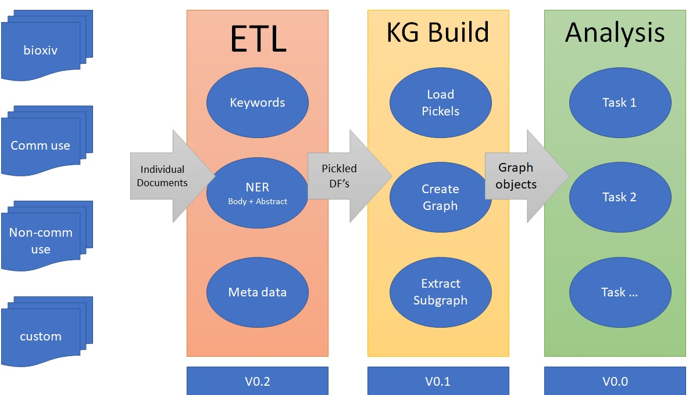

# Kaggle COVID-19  

[Open Research Dataset Challenge (CORD-19)](https://www.kaggle.com/allen-institute-for-ai/CORD-19-research-challenge)

We are issuing a call to action to the world's artificial intelligence experts to develop text and data mining tools that can help the medical community develop answers to high priority scientific questions. The CORD-19 dataset represents the most extensive machine-readable coronavirus literature collection available for data mining to date. This allows the worldwide AI research community the opportunity to apply text and data mining approaches to find answers to questions within, and connect insights across, this content in support of the ongoing COVID-19 response efforts worldwide. There is a growing urgency for these approaches because of the rapid increase in coronavirus literature, making it difficult for the medical community to keep up.

There are a number of tasks that are requested for analysis an indepth list can be found at the following [link](https://www.kaggle.com/allen-institute-for-ai/CORD-19-research-challenge/tasks).
Each task has its own sucess and scoring criteria. The scoring equally weights the approach, documentation and presentaiton. 

# Approach

The approach proposed by this work is to create a robust extract and enrich pipeline that can be used to answer any of the tasks.
The current state of the approach looks like the below:

## TODO

1) Replace spacy model in ETL with a more appropiate model:

scispacy:
@inproceedings{Neumann2019ScispaCyFA, title={ScispaCy: Fast and Robust Models for Biomedical Natural Language Processing}, author={Mark Neumann and Daniel King and Iz Beltagy and Waleed Ammar}, year={2019}, Eprint={arXiv:1902.07669} }

2) Refine extraction for multple subject - object sentence pairs. 
3) Refile the keyword/phrase extraction form the task list to improve graph filtering.
4) Integrate an interactive graph vis tool for improved analysis.
5) Define experiments for each Task.
